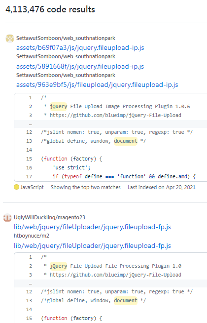

# GitHub Code Search Deduplication

Say you are looking for jQuery example code on GitHub.
Tired of scrolling through 9 identical snippets for jQuery itself?

This Chrome extension removes the duplicates but still preserves
the links to all the repositories containing the duplicated snippet.

